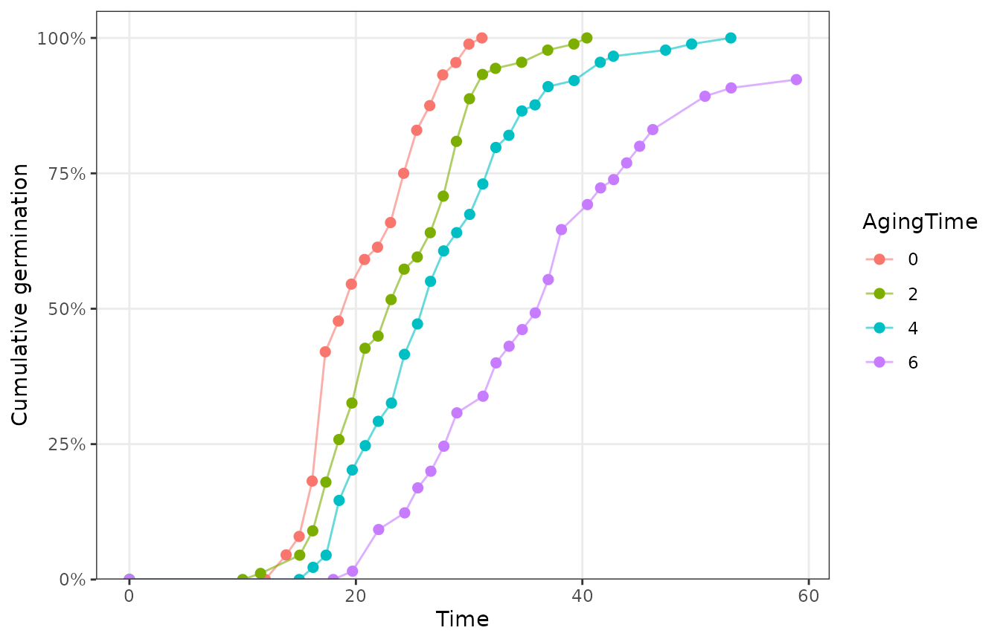
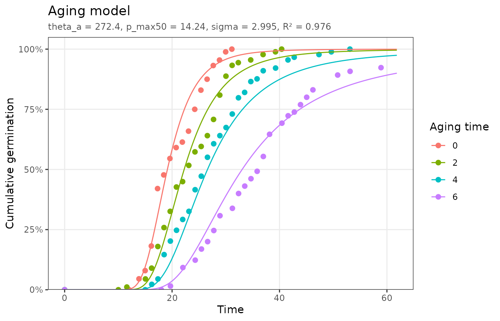
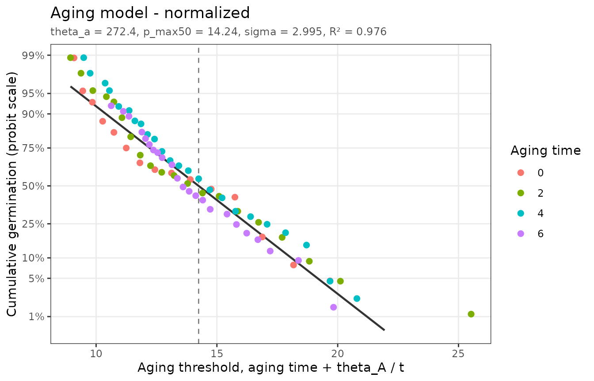

# Seed aging

``` r

library(pbtm)
```

## The model

As seeds age, germination first slows while viability stays nearly
constant. Viability then declines along a sigmoid curve. Seeds in a lot
have a range of potential lifetimes that follow a normal distribution
(Ellis and Roberts, 1981). Bradford et al. (1993) used the increasing
germination delays to predict that decline with a threshold model:

``` math
\theta_A = (p_{max}(g) - p)\, t_g
```

where $`p`$ is the aging (storage) period, $`p_{max}(g)`$ is the maximum
lifetime of seed fraction `g`, normally distributed with median
$`p_{max}(50)`$ and standard deviation $`\sigma`$, and $`\theta_A`$ is
the aging time constant. Germination falls as the aging period
approaches each seed’s lifetime, so the fitted model uses the upper tail
of the distribution:

``` math
g = 1 - \Phi\left(\frac{p + \theta_A / t_g - p_{max}(50)}{\sigma}\right)
```

## Fitting

`aging_data` holds germination time courses of lettuce seeds after 0 to
6 days of accelerated aging:

``` r

plot_germ_data(aging_data, color = "AgingTime")
```



``` r

fit <- fit_aging(aging_data)
fit
#> <pbtm_fit> Aging model
#> 
#> theta_a p_max50   sigma 
#>   272.4   14.24   2.995 
#> 
#> n = 93, pseudo-R2 = 0.9764, AIC = -539.3
autoplot(fit)
```



Half of the seeds would lose viability after 14.2 days of accelerated
aging, with a standard deviation of 3 days. The units of $`\theta_A`$
are aging time × germination time (here day·hours).

On the normalized axis, each observation is placed at the aging
threshold implied by its germination time, $`p + \theta_A / t`$. The
line shows the fraction of seeds whose lifetime exceeds that threshold:

``` r

autoplot(fit, type = "normalized")
#> Dropped 7 points that cannot be shown on the linear/probit axes (e.g. 0% or
#> 100% germination).
```



## Predicting the loss of viability

The fitted distribution predicts the viability curve beyond the aging
periods tested, which is the main practical use of the model. Viability
after aging period $`p`$ is the fraction of seeds with $`p_{max} > p`$:

``` r

p <- coef(fit)
aging <- seq(0, 25, by = 5)
data.frame(
  AgingTime = aging,
  viability = pnorm(aging, p[["p_max50"]], p[["sigma"]], lower.tail = FALSE)
)
#>   AgingTime   viability
#> 1         0 0.999999011
#> 2         5 0.998986461
#> 3        10 0.921720559
#> 4        15 0.400228523
#> 5        20 0.027287057
#> 6        25 0.000164234
```

Accelerated-aging results must be calibrated against the temperature and
moisture conditions under which the seeds will actually be stored
(Bradford and Bello, 2023).

## References

Bradford, K.J., Bello, P. (2023) Understanding seed behavior:
populations of individuals. *Acta Hortic.* 1365: 1–16.
<https://doi.org/10.17660/ActaHortic.2023.1365.1>

Bradford, K.J., Tarquis, A.M., Duran, J.M. (1993) A population-based
threshold model describing the relationship between germination rates
and seed deterioration. *J. Exp. Bot.* 44: 1225–1234.
<https://doi.org/10.1093/jxb/44.7.1225>

Ellis, R.H., Roberts, E.H. (1981) The quantification of ageing and
survival in orthodox seeds. *Seed Sci. Technol.* 9: 373–409.
