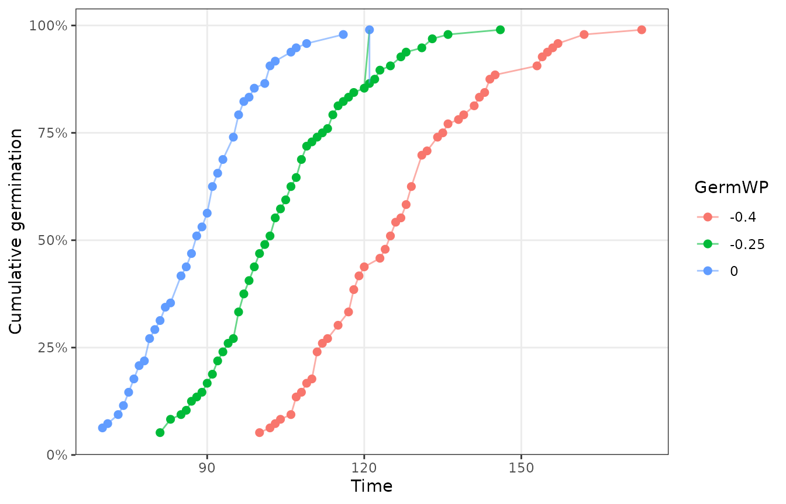
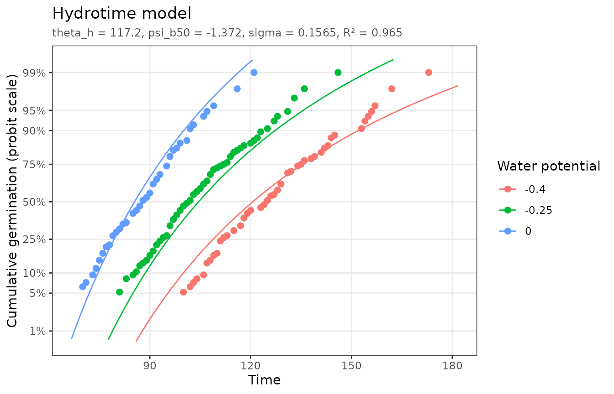
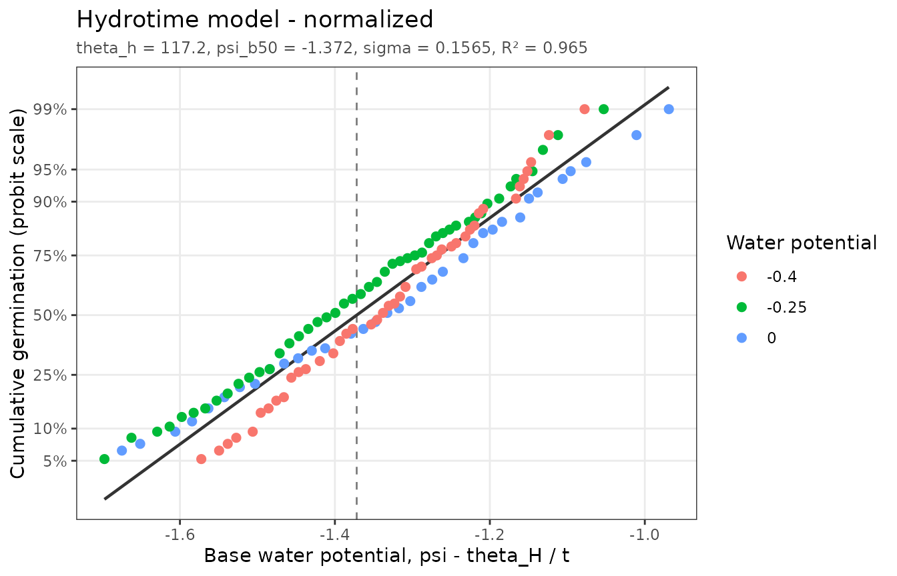
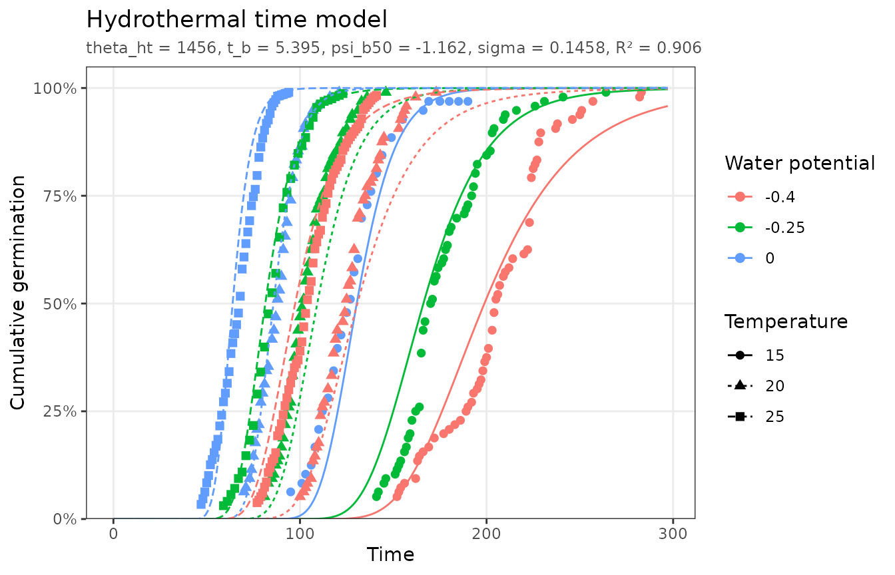
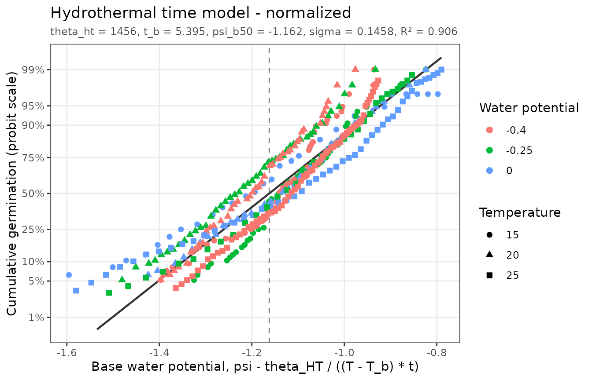

# Hydrotime and hydrothermal time

``` r

library(pbtm)
```

## Hydrotime

Seeds germinate more slowly, and fewer of them germinate, as the water
potential $`\psi`$ of their surroundings decreases. The hydrotime model
(Gummerson, 1986; Bradford, 1990) states that the *hydrotime* to
germination is constant:

``` math
\theta_H = (\psi - \psi_b(g))\, t_g
```

where $`t_g`$ is the time to germination of fraction `g`. The base water
potential $`\psi_b(g)`$, below which a seed cannot germinate, varies
normally across the population with median $`\psi_b(50)`$ and standard
deviation $`\sigma`$. Solving for the germinated fraction gives the
fitted model:

``` math
g = \Phi\left(\frac{\psi - \theta_H / t_g - \psi_b(50)}{\sigma}\right)
```

`hydrotime_data` has tomato seeds germinated at 20 °C and three water
potentials. Hydrotime data should come from a single temperature; filter
other temperatures out first.

``` r

plot_germ_data(hydrotime_data, color = "GermWP")
```



``` r

fit_ht <- fit_hydrotime(hydrotime_data)
fit_ht
#> <pbtm_fit> Hydrotime model
#> 
#> theta_h psi_b50   sigma 
#>   117.2  -1.372  0.1565 
#> 
#> n = 125, pseudo-R2 = 0.9649, AIC = -706.8
```

Half the seeds can germinate at water potentials down to -1.37 MPa. The
hydrotime constant is 117 MPa·h.

``` r

autoplot(fit_ht)
```


On a probit fraction axis the fitted curves become nearly straight. The
normalized plot places every observation at the base water potential
implied by its germination time, $`\psi - \theta_H / t`$. All water
potentials then fall on one line, the population’s distribution of
$`\psi_b`$:

``` r

autoplot(fit_ht, y_scale = "probit")
```



``` r

autoplot(fit_ht, type = "normalized")
```



The median germination time at any water potential above $`\psi_b(50)`$
is $`t_{50} = \theta_H / (\psi - \psi_b(50))`$:

``` r

p <- coef(fit_ht)
wp <- c(0, -0.25, -0.4)
data.frame(GermWP = wp, predicted_t50 = p[["theta_h"]] / (wp - p[["psi_b50"]]))
#>   GermWP predicted_t50
#> 1   0.00      85.46279
#> 2  -0.25     104.50754
#> 3  -0.40     120.63743
germ_speed(hydrotime_data, 0.5, groups = "GermWP")
#> # A tibble: 3 × 4
#>   GermWP Fraction  Time      GR
#>    <dbl>    <dbl> <dbl>   <dbl>
#> 1  -0.4       0.5  125. 0.00802
#> 2  -0.25      0.5  102. 0.00985
#> 3   0         0.5  116. 0.00861
```

The predictions are close to the observed medians at -0.25 and -0.4 MPa.
In this example dataset, however, the seeds in water (0 MPa) germinated
more slowly than those at -0.25 MPa, contrary to the model. The
normalized plot above shows this: the 0 MPa points fall to the right of
the line in its upper half, and the treatments do not collapse perfectly
onto it. Departures like this are worth checking against the
experimental records before drawing conclusions from the parameters.

## Hydrothermal time

The hydrothermal time model combines the thermal and hydrotime models to
describe germination across both temperature and water potential
(Gummerson, 1986; Bradford, 1995):

``` math
\theta_{HT} = (\psi - \psi_b(g))\,(T - T_b)\, t_g
```

``` math
g = \Phi\left(\frac{\psi - \theta_{HT} / [(T - T_b)\, t_g] - \psi_b(50)}{\sigma}\right)
```

`hydrothermal_time_data` crosses three temperatures with three water
potentials:

``` r

fit_htt <- fit_hydrothermal_time(hydrothermal_time_data)
fit_htt
#> <pbtm_fit> Hydrothermal time model
#> 
#> theta_ht      t_b  psi_b50    sigma 
#>     1456    5.395   -1.162   0.1458 
#> 
#> n = 398, pseudo-R2 = 0.906, AIC = -1843
autoplot(fit_htt)
```



The normalized plot uses both estimated constants, $`\theta_{HT}`$ and
$`T_b`$, to put all nine treatments on a common base water potential
scale:

``` r

autoplot(fit_htt, type = "normalized")
```



Systematic departures from a single line, for example one temperature
lying consistently above the others, show where the assumption of a
constant $`\psi_b`$ distribution across temperatures breaks down. In
practice $`\psi_b(50)`$ often shifts with temperature, particularly
above the optimum.

## References

Bradford, K.J. (1990) A water relations analysis of seed germination
rates. *Plant Physiol.* 94: 840–849.
<https://doi.org/10.1104/pp.94.2.840>

Bradford, K.J. (1995) Water relations in seed germination. In J Kigel, G
Galili, eds, *Seed Development and Germination*. Marcel Dekker, New
York, pp 351–396.

Gummerson, R.J. (1986) The effect of constant temperatures and osmotic
potentials on the germination of sugar beet. *J. Exp. Bot.* 37: 729–741.
