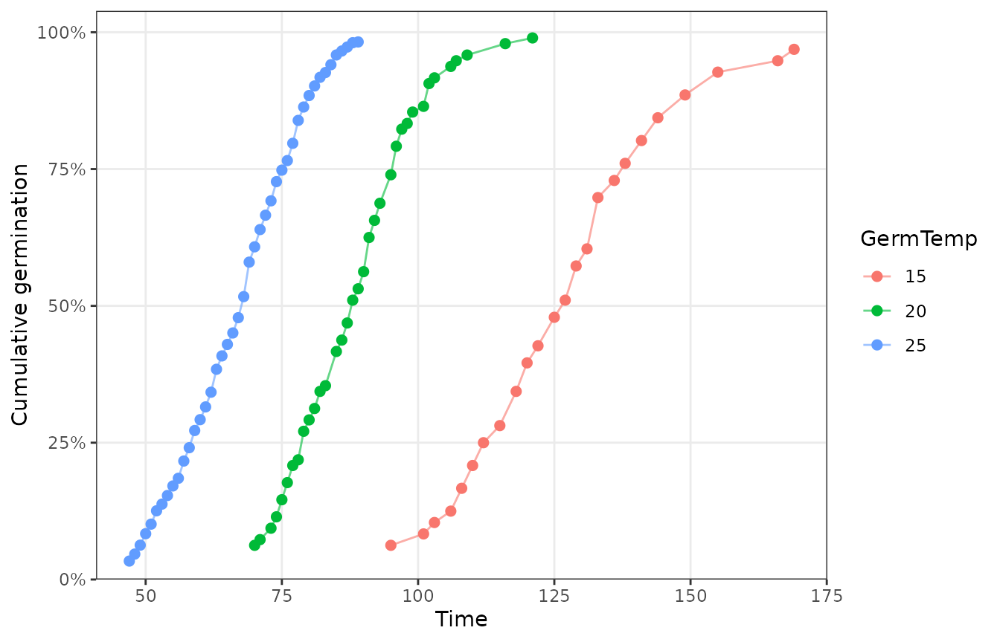
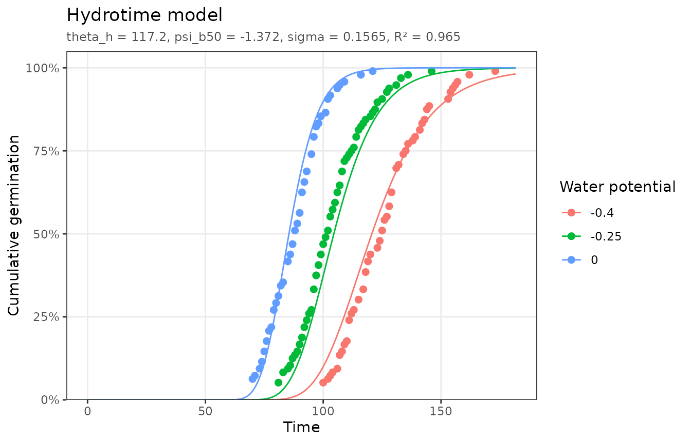
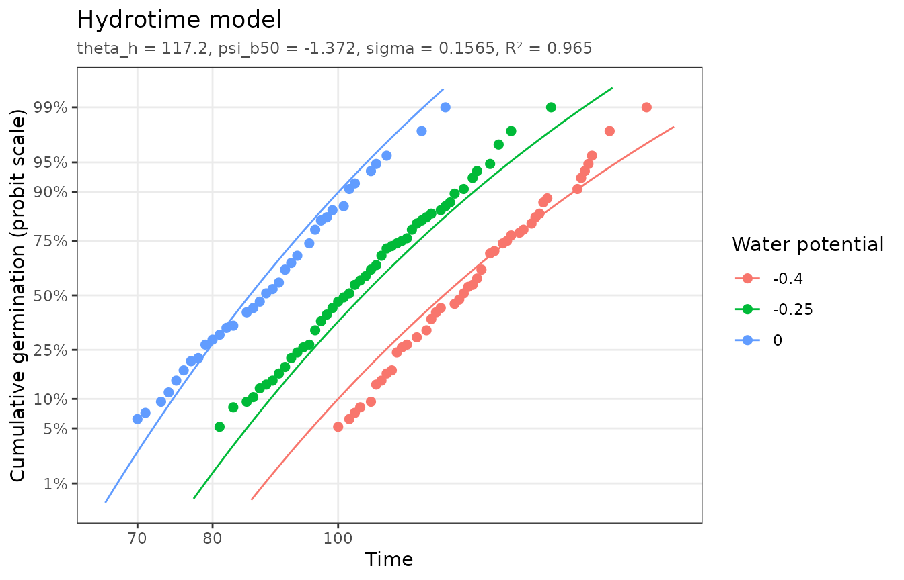

# Getting started with pbtm

``` r

library(pbtm)
```

Population-based threshold (PBT) models describe how a population of
seeds responds to a factor such as temperature, water potential, a
hormone, or aging. Each seed has its own *threshold* for the factor, and
thresholds vary normally across the population. When the factor exceeds
a seed’s threshold, that seed germinates at a rate proportional to the
amount by which the threshold is exceeded. Fitting a PBT model to
germination time courses collected at several factor levels estimates
the threshold distribution (its median and standard deviation) and a
time constant for the response, from which germination under any other
condition can be predicted (Bradford and Bello, 2022).

pbtm fits these models with nonlinear least squares and plots the
results. This vignette covers data preparation and the tools shared by
every model; each model has its own vignette:

- [`vignette("thermal-time")`](https://pbt-models.github.io/pbtm/articles/thermal-time.md):
  base temperature and thermal time.
- [`vignette("hydrotime")`](https://pbt-models.github.io/pbtm/articles/hydrotime.md):
  hydrotime and hydrothermal time.
- [`vignette("priming")`](https://pbt-models.github.io/pbtm/articles/priming.md):
  hydropriming and hydrothermal priming.
- [`vignette("aging")`](https://pbt-models.github.io/pbtm/articles/aging.md):
  seed aging.
- [`vignette("promoters-inhibitors")`](https://pbt-models.github.io/pbtm/articles/promoters-inhibitors.md):
  hormone dose responses.
- [`vignette("subpopulations")`](https://pbt-models.github.io/pbtm/articles/subpopulations.md):
  seed lots made of several subpopulations.

## Preparing data

pbtm expects one row per observation of a germination time course, with
the cumulative elapsed time (`CumTime`) and the cumulative fraction of
seeds germinated by that time (`CumFraction`, from 0 to 1). Treatment
columns repeat the treatment’s value on every row of its time course.
`pbtm_columns` lists the template columns, their valid ranges, and which
models use them:

``` r

pbtm_columns[, c("Column", "Description", "Min", "Max")]
#> # A tibble: 12 × 4
#>    Column              Description                       Min   Max
#>    <chr>               <chr>                           <dbl> <dbl>
#>  1 TrtID               Treatment ID                       NA    NA
#>  2 TrtDesc             Treatment description              NA    NA
#>  3 GermTemp            Germination temperature             0   100
#>  4 GermWP              Germination water potential        NA     0
#>  5 PrimingTemp         Priming temperature                 0   100
#>  6 PrimingWP           Priming water potential            NA     0
#>  7 PrimingDuration     Priming duration                    0    NA
#>  8 AgingTime           Aging time                          0    NA
#>  9 GermPromoterDosage  Germination promoter dosage         0    NA
#> 10 GermInhibitorDosage Germination inhibitor dosage        0    NA
#> 11 CumTime             Cumulative time                     0    NA
#> 12 CumFraction         Cumulative germination fraction     0     1
```

`TrtID` identifies each time course and `TrtDesc` describes it. Every
model needs `CumTime` and `CumFraction` plus its own treatment columns,
which
[`pbtm_models()`](https://pbt-models.github.io/pbtm/reference/pbtm_models.md)
lists:

``` r

pbtm_models()[, c("model", "label", "factors", "params")]
#> # A tibble: 8 × 4
#>   model                label                factors      params      
#>   <chr>                <chr>                <named list> <named list>
#> 1 thermal_time         Thermal time         <chr [1]>    <chr [3]>   
#> 2 hydrotime            Hydrotime            <chr [1]>    <chr [3]>   
#> 3 hydrothermal_time    Hydrothermal time    <chr [2]>    <chr [4]>   
#> 4 hydropriming         Hydropriming         <chr [2]>    <chr [3]>   
#> 5 hydrothermal_priming Hydrothermal priming <chr [3]>    <chr [4]>   
#> 6 aging                Aging                <chr [1]>    <chr [3]>   
#> 7 promoter             Promoter             <chr [1]>    <chr [3]>   
#> 8 inhibitor            Inhibitor            <chr [1]>    <chr [3]>
```

The package includes an example dataset for each model (see
[`?pbtm_datasets`](https://pbt-models.github.io/pbtm/reference/pbtm_datasets.md)):

``` r

head(germination_data)
#> # A tibble: 6 × 5
#>   TrtID TrtDesc          GermTemp CumTime CumFraction
#>   <dbl> <chr>               <dbl>   <dbl>       <dbl>
#> 1     1 Tomato-15C-Water       15      95      0.0625
#> 2     1 Tomato-15C-Water       15     101      0.0833
#> 3     1 Tomato-15C-Water       15     103      0.104 
#> 4     1 Tomato-15C-Water       15     106      0.125 
#> 5     1 Tomato-15C-Water       15     108      0.167 
#> 6     1 Tomato-15C-Water       15     110      0.208
```

If your data are raw counts,
[`calc_cum_frac()`](https://pbt-models.github.io/pbtm/reference/calc_cum_frac.md)
converts cumulative counts of germinated seeds into `CumFraction`.
[`validate_germ_data()`](https://pbt-models.github.io/pbtm/reference/validate_germ_data.md)
checks column types and ranges, and optionally that a model’s columns
are present:

``` r

validate_germ_data(hydrotime_data, "hydrotime")
```

Data with different column names can be used without renaming them by
passing a `cols` mapping from template names to your names to
[`validate_germ_data()`](https://pbt-models.github.io/pbtm/reference/validate_germ_data.md)
or any fitting function:

``` r

my_data <- dplyr::rename(thermal_time_data, temp = GermTemp, hours = CumTime)
fit <- fit_thermal_time(my_data, cols = c(GermTemp = "temp", CumTime = "hours"))
```

## Exploring germination time courses

[`plot_germ_data()`](https://pbt-models.github.io/pbtm/reference/plot_germ_data.md)
plots the raw time courses:

``` r

plot_germ_data(germination_data, color = "GermTemp")
```



[`germ_speed()`](https://pbt-models.github.io/pbtm/reference/germ_speed.md)
interpolates the time for each treatment to reach given germination
fractions and the corresponding germination rate (`GR = 1 / Time`). The
16% and 84% fractions are one standard deviation either side of the
median:

``` r

germ_speed(germination_data, fractions = c(0.1, 0.16, 0.5, 0.84, 0.9))
#> # A tibble: 15 × 4
#>    TrtID Fraction  Time      GR
#>    <dbl>    <dbl> <dbl>   <dbl>
#>  1     1     0.1  103.  0.00975
#>  2     1     0.16 108.  0.00929
#>  3     1     0.5  126.  0.00792
#>  4     1     0.84 144.  0.00696
#>  5     1     0.9  151.  0.00662
#>  6     4     0.1   73.3 0.0136 
#>  7     4     0.16  75.5 0.0133 
#>  8     4     0.5   87.7 0.0114 
#>  9     4     0.84  98.3 0.0102 
#> 10     4     0.9  102.  0.00982
#> 11     7     0.1   50.9 0.0196 
#> 12     7     0.16  54.4 0.0184 
#> 13     7     0.5   67.6 0.0148 
#> 14     7     0.84  78.0 0.0128 
#> 15     7     0.9   80.9 0.0124
```

To summarize over several treatments at once, name the columns to group
by. Time courses sharing those values are pooled with
[`rescale_cum_frac()`](https://pbt-models.github.io/pbtm/reference/rescale_cum_frac.md),
which adds up their germination increments and re-accumulates them into
one curve.

Observations where germination did not increase since the previous time
point add no information about individual seeds’ germination times but
still pull on the fitted curves.
[`clean_germ_data()`](https://pbt-models.github.io/pbtm/reference/clean_germ_data.md)
removes them, keeping the first time each cumulative fraction was
reached. Using cleaned data is recommended for most analyses:

``` r

nrow(promoter_data)
#> [1] 57
nrow(clean_germ_data(promoter_data))
#> [1] 47
```

## Fitting a model

Each model has a fitting function
([`fit_thermal_time()`](https://pbt-models.github.io/pbtm/reference/fit_thermal_time.md),
[`fit_hydrotime()`](https://pbt-models.github.io/pbtm/reference/fit_hydrotime.md),
…), and
[`fit_pbtm()`](https://pbt-models.github.io/pbtm/reference/fit_pbtm.md)
fits any model by its id. All of them share the same options:

- `max_frac`: the highest fraction the population can reach, for seed
  lots that do not germinate fully even under optimal conditions.
- `fixed`: parameter values to hold constant,
  e.g. `fixed = list(t_b = 5)`.
- `bounds`: custom `c(lower, start, upper)` bounds for any parameter
  (defaults are in `pbtm_models()$bounds`).
- `subpops`: fit a mixture of seed subpopulations (see
  [`vignette("subpopulations")`](https://pbt-models.github.io/pbtm/articles/subpopulations.md)).

``` r

fit <- fit_hydrotime(hydrotime_data)
fit
#> <pbtm_fit> Hydrotime model
#> 
#> theta_h psi_b50   sigma 
#>   117.2  -1.372  0.1565 
#> 
#> n = 125, pseudo-R2 = 0.9649, AIC = -706.8
```

The fit works with the usual model functions:

``` r

coef(fit)
#>     theta_h     psi_b50       sigma 
#> 117.2436813  -1.3718682   0.1564849
summary(fit)
#> Hydrotime model
#> 
#> Coefficients:
#>         estimate std_error fixed
#> theta_h 117.2437  2.151856 FALSE
#> psi_b50  -1.3719  0.020820 FALSE
#> sigma     0.1565  0.005303 FALSE
#> 
#> n = 125, parameters = 3, RSS = 0.4107, AIC = -706.8, pseudo-R2 = 0.9649
predict(fit, newdata = data.frame(GermWP = -0.3, CumTime = c(100, 200, 300)))
#> [1] 0.2602182 0.9990437 0.9999933
```

If an estimate ends up on one of its bounds, or the fit does not
converge, pbtm warns you. This usually means the data do not constrain
that parameter well, and it can be held `fixed` or given wider `bounds`.

## Plotting fits and linearized scales

[`autoplot()`](https://ggplot2.tidyverse.org/reference/autoplot.html)
(or [`plot()`](https://rdrr.io/r/graphics/plot.default.html)) draws the
data with the fitted model:

``` r

autoplot(fit)
```



The cumulative models are normal distributions of thresholds, so their
S-shaped curves become close to straight lines when the fraction axis
uses the normal quantile, or *probit*, scale. For thermal time, whose
distribution is log-normal in time, a log time axis combined with a
probit fraction axis makes the fitted curves exactly straight.
Deviations from a straight line then point to where the model fits
poorly. Observations at 0% or 100% germination cannot be drawn on a
probit axis and are dropped with a message.

``` r

autoplot(fit, x_scale = "log", y_scale = "probit")
```



The `"normalized"` plot goes a step further: it places each observation
on the model’s threshold axis (here, the base water potential that seed
must have had, `GermWP - theta_h / CumTime`). All treatments then
collapse onto the single population distribution, a straight line on the
probit scale, with the dashed line marking the median:

``` r

autoplot(fit, type = "normalized")
```


## References

Bradford, K.J., Bello, P. (2022) Applying population-based threshold
models to quantify and improve seed quality attributes. In J Buitink, O
Leprince, eds, *Advances in Seed Science and Technology for More
Sustainable Crop Production*. Burleigh Dodds Science Publishing,
Cambridge, UK. <https://doi.org/10.19103/AS.2022.0105.05>
