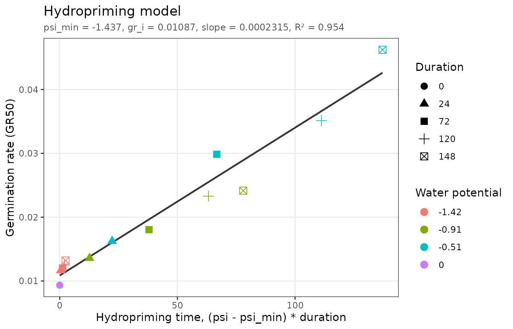
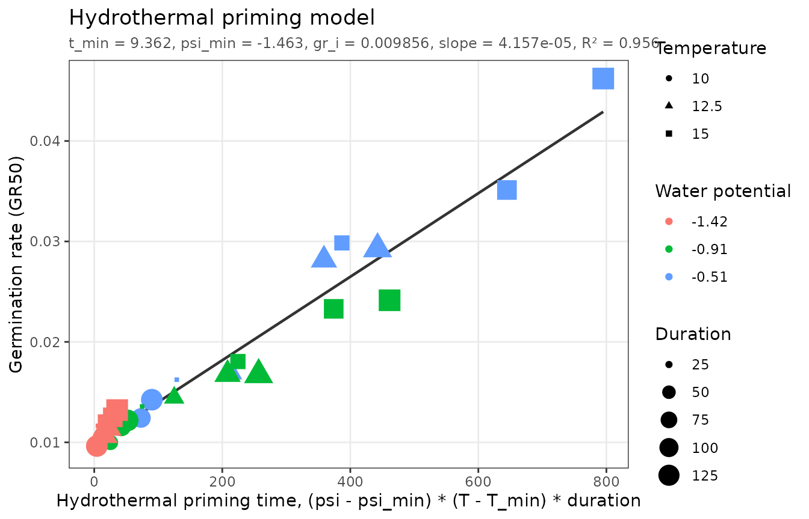

# Hydropriming and hydrothermal priming

``` r

library(pbtm)
```

Priming hydrates seeds to just below the level needed to complete
germination, holds them there for a while, and dries them again
(Bradford, 1986). Primed seeds germinate faster and more uniformly. The
advancement depends on the priming water potential and duration, and,
for hydrothermal priming, on the priming temperature (Bradford and
Haigh, 1994).

Unlike the other models, the priming models are fit to germination
*rates*. The data are germination time courses of seed samples primed
under different conditions and then germinated under standard
conditions. The fitting functions first compute the germination rate of
each priming treatment at a chosen fraction (`speed = 0.5` by default,
i.e. $`GR_{50}`$, the inverse of the time to 50% germination) with
[`germ_speed()`](https://pbt-models.github.io/pbtm/reference/germ_speed.md),
and then fit a line to those rates.

## Hydropriming

The hydropriming time accumulated during priming at water potential
$`\psi_P`$ for duration $`t_P`$ is $`(\psi_P - \psi_{min})\,t_P`$, where
$`\psi_{min}`$ is the lowest water potential that still has a priming
effect. Germination rates increase linearly with it:

``` math
GR_{50} = GR_i + \frac{(\psi_P - \psi_{min})\,t_P}{\theta_{HP}}
```

where $`GR_i`$ is the rate of unprimed seeds and $`\theta_{HP}`$ is the
hydropriming time constant. pbtm estimates the `slope`,
$`1/\theta_{HP}`$.

`hydropriming_data` includes unprimed controls and priming at three
water potentials for up to 148 hours:

``` r

fit_hp <- fit_hydropriming(hydropriming_data)
fit_hp
#> <pbtm_fit> Hydropriming model
#> 
#>   psi_min      gr_i     slope 
#>    -1.437   0.01087 0.0002315 
#> 
#> n = 13, pseudo-R2 = 0.9544, AIC = -150.5; rates at 50% germination
```

The germination rates the model was fit to are in `fit_hp$data`:

``` r

head(fit_hp$data)
#> # A tibble: 6 × 6
#>   TrtID PrimingWP PrimingDuration Fraction  Time      GR
#>   <dbl>     <dbl>           <dbl>    <dbl> <dbl>   <dbl>
#> 1     1      0                  0      0.5 107.  0.00934
#> 2     2     -0.51              24      0.5  61.6 0.0162 
#> 3     3     -0.51              72      0.5  33.5 0.0299 
#> 4     4     -0.51             120      0.5  28.5 0.0351 
#> 5     5     -0.51             148      0.5  21.6 0.0462 
#> 6     6     -0.91              24      0.5  73.7 0.0136
```

The rates lie on a line against hydropriming time, which requires a
`psi_min` estimate to compute:

``` r

autoplot(fit_hp)
```



Log axes on both scales (`x_scale = "log", y_scale = "log"`) are also
available. Because of the $`GR_i`$ intercept, the fitted line curves on
a log-log plot.

### Designing a priming treatment

Any combination of water potential and duration that accumulates the
same hydropriming time has the same effect. Rearranging the model gives
the duration needed at a chosen water potential to reach a target rate:

``` r

p <- coef(fit_hp)
target_gr <- 0.02
psi <- c(-0.5, -1)
data.frame(
  PrimingWP = psi,
  duration = (target_gr - p[["gr_i"]]) / (p[["slope"]] * (psi - p[["psi_min"]]))
)
#>   PrimingWP duration
#> 1      -0.5 42.10678
#> 2      -1.0 90.31107
```

[`predict()`](https://rdrr.io/r/stats/predict.html) gives the expected
rate for any proposed treatment:

``` r

predict(fit_hp, newdata = data.frame(PrimingWP = -0.5, PrimingDuration = c(24, 48, 96)))
#> [1] 0.01607304 0.02127811 0.03168824
```

## Hydrothermal priming

Hydrothermal priming time also counts the temperature above a minimum
temperature $`T_{min}`$ for a priming effect:

``` math
GR_{50} = GR_i + \frac{(\psi_P - \psi_{min})(T_P - T_{min})\,t_P}{\theta_{HTP}}
```

``` r

fit_htp <- fit_hydrothermal_priming(hydrothermal_priming_data)
fit_htp
#> <pbtm_fit> Hydrothermal priming model
#> 
#>     t_min   psi_min      gr_i     slope 
#>     9.362    -1.463  0.009856 4.157e-05 
#> 
#> n = 36, pseudo-R2 = 0.9561, AIC = -447.7; rates at 50% germination
autoplot(fit_htp)
```



Warmer or wetter priming shortens the duration needed, and cooler or
drier priming lengthens it. The same effect can therefore be reached
with whatever combination of temperature, water potential, and duration
is most convenient.

## Rates at other fractions

To base the model on a different part of the germination time course,
change `speed`, for example to the time to 25% germination:

``` r

fit_hydropriming(hydropriming_data, speed = 0.25)
#> <pbtm_fit> Hydropriming model
#> 
#>   psi_min      gr_i     slope 
#>    -1.429  0.008815 0.0005085 
#> 
#> n = 13, pseudo-R2 = 0.8884, AIC = -117.6; rates at 25% germination
```

If you already have a table of germination rates, pass it with a `GR`
column (and no `CumFraction` column) and it is used directly.

## References

Bradford, K.J. (1986) Manipulation of seed water relations via osmotic
priming to improve germination under stress conditions. *HortScience*
21: 1105–1112.

Bradford, K.J., Haigh, A.M. (1994) Relationship between accumulated
hydrothermal time during seed priming and subsequent seed germination
rates. *Seed Sci. Res.* 4: 1–10.
