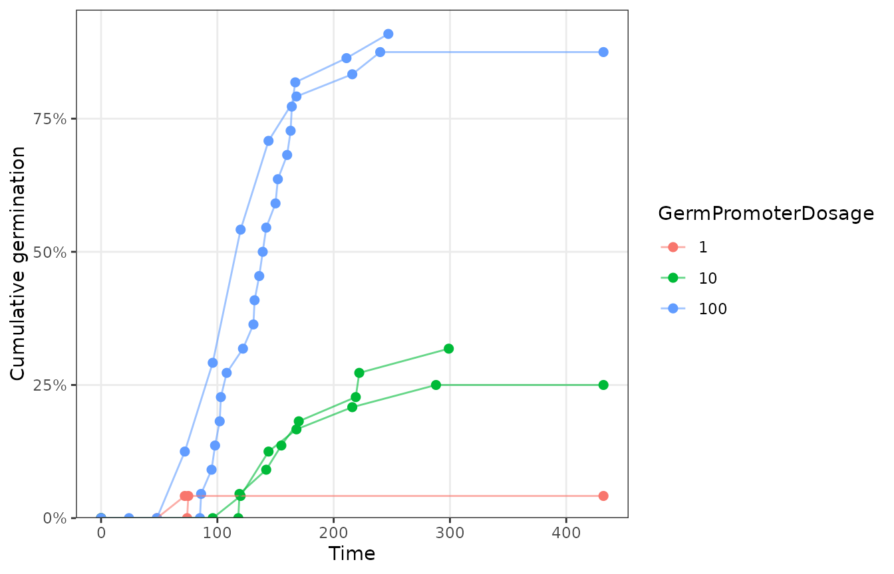
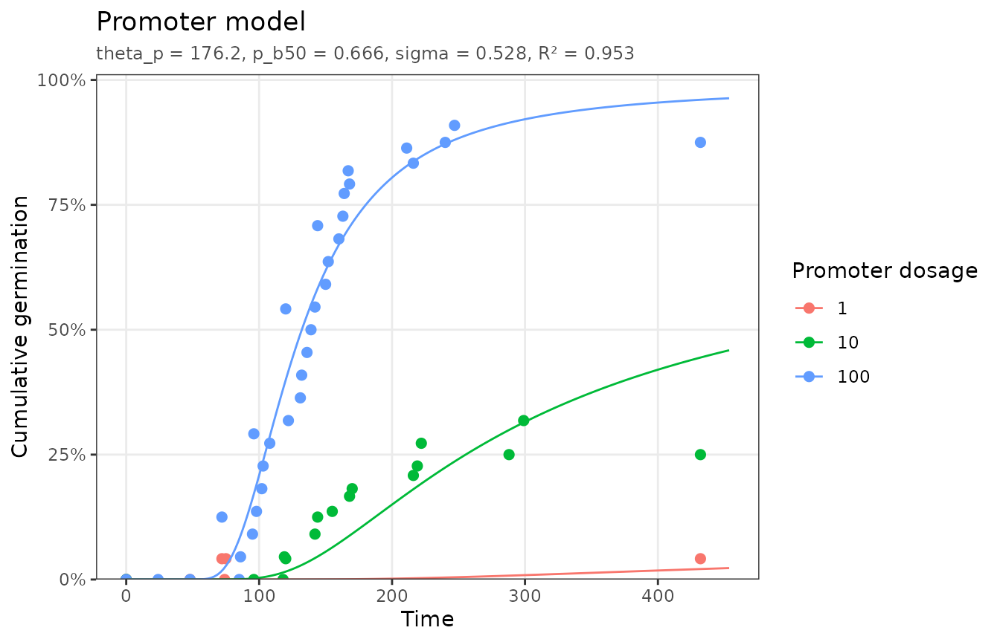
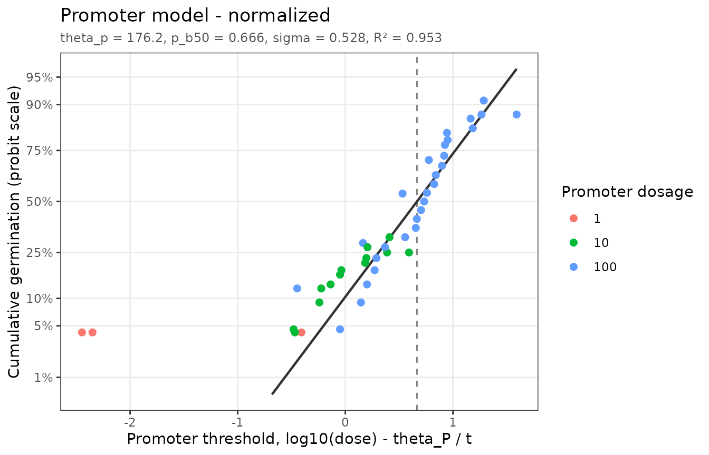
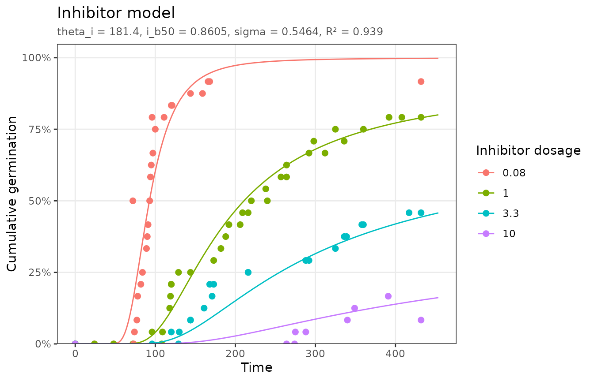
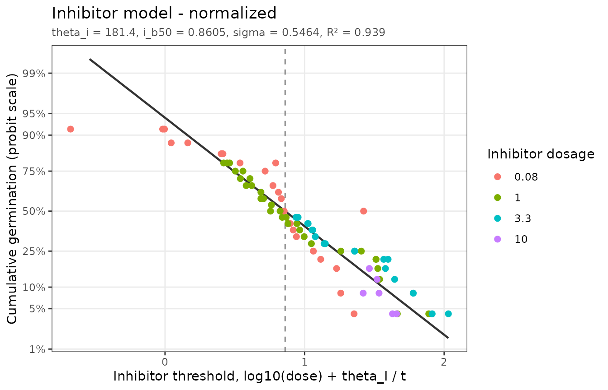

# Promoters and inhibitors

``` r

library(pbtm)
```

Chemical factors can speed up or slow down germination. Hormones are the
classic example: gibberellin (GA) breaks dormancy and promotes
germination, while abscisic acid (ABA) induces dormancy and inhibits it.
The same threshold logic applies: each seed has a threshold dose, and
the response rate depends on how far the applied dose is from it (Ni and
Bradford, 1992, 1993).

Hormone dose responses are usually linear on a log scale, so both models
take `dose_transform = "log10"`. The threshold parameters (`p_b50`,
`i_b50`, and `sigma`) are then in log10 dose units.

## Promoters

``` math
\theta_P = (\log[P] - \log[P_b(g)])\, t_g
```

``` math
g = \Phi\left(\frac{\log[P] - \theta_P / t_g - \log P_b(50)}{\sigma}\right)
```

`promoter_data` has tomato seeds germinated with three GA
concentrations:

``` r

plot_germ_data(promoter_data, color = "GermPromoterDosage")
```



``` r

fit_p <- fit_promoter(promoter_data, dose_transform = "log10")
fit_p
#> <pbtm_fit> Promoter model
#> 
#> theta_p   p_b50   sigma 
#>   176.2   0.666   0.528 
#> 
#> n = 57, pseudo-R2 = 0.9526, AIC = -302.1; dose transform = log10
autoplot(fit_p)
```



The median base GA dose is $`10^{0.666}`$ = 4.63 dose units.

The choice of scale matters. On the linear dose scale the fit is much
worse, and the time constant runs into its upper bound, which pbtm
reports as a warning:

``` r

fit_linear <- fit_promoter(promoter_data)
#> Warning: theta_p is at its bound.
#> ℹ The data may not constrain this parameter; consider widening `bounds` or
#>   holding it `fixed`.
c(log10 = fit_p$stats$pseudo_r2, linear = fit_linear$stats$pseudo_r2)
#>     log10    linear 
#> 0.9525839 0.4269089
```

The normalized plot uses the threshold axis $`\log[P] - \theta_P / t`$:

``` r

autoplot(fit_p, type = "normalized")
#> Dropped 7 points that cannot be shown on the linear/probit axes (e.g. 0% or
#> 100% germination).
```



## Inhibitors

Inhibitors act in the opposite direction: germination slows and declines
as the dose approaches each seed’s inhibitory threshold, so the model
uses the upper tail of the threshold distribution:

``` math
\theta_I = (\log[I_b(g)] - \log[I])\, t_g
```

``` math
g = 1 - \Phi\left(\frac{\log[I] + \theta_I / t_g - \log I_b(50)}{\sigma}\right)
```

`inhibitor_data` has tomato seeds germinated with ABA:

``` r

fit_i <- fit_inhibitor(inhibitor_data, dose_transform = "log10")
fit_i
#> <pbtm_fit> Inhibitor model
#> 
#> theta_i   i_b50   sigma 
#>   181.4  0.8605  0.5464 
#> 
#> n = 97, pseudo-R2 = 0.939, AIC = -501.5; dose transform = log10
autoplot(fit_i)
```



``` r

autoplot(fit_i, type = "normalized")
#> Dropped 11 points that cannot be shown on the linear/probit axes (e.g. 0% or
#> 100% germination).
```



Half of the seeds are prevented from germinating at ABA doses above 7.25
dose units.

## Predicting dose responses

With the fitted model, final germination and germination timing can be
predicted for untested doses. Pass the untransformed dose; the fit
applies its own transform:

``` r

new <- expand.grid(GermInhibitorDosage = c(0.5, 2, 5), CumTime = c(48, 96, 192))
cbind(new, CumFraction = round(predict(fit_i, new), 3))
#>   GermInhibitorDosage CumTime CumFraction
#> 1                 0.5      48       0.000
#> 2                 2.0      48       0.000
#> 3                 5.0      48       0.000
#> 4                 0.5      96       0.091
#> 5                 2.0      96       0.007
#> 6                 5.0      96       0.001
#> 7                 0.5     192       0.654
#> 8                 2.0     192       0.240
#> 9                 5.0     192       0.076
```

## References

Ni, B.-R., Bradford, K.J. (1992) Quantitative models characterizing seed
germination responses to abscisic acid and osmoticum. *Plant Physiol.*
98: 1057–1068. <https://doi.org/10.1104/pp.98.3.1057>

Ni, B.-R., Bradford, K.J. (1993) Germination and dormancy of abscisic
acid- and gibberellin-deficient mutant tomato seeds: sensitivity of
germination to abscisic acid, gibberellin, and water potential. *Plant
Physiol.* 101: 607–617. <https://doi.org/10.1104/pp.101.2.607>
