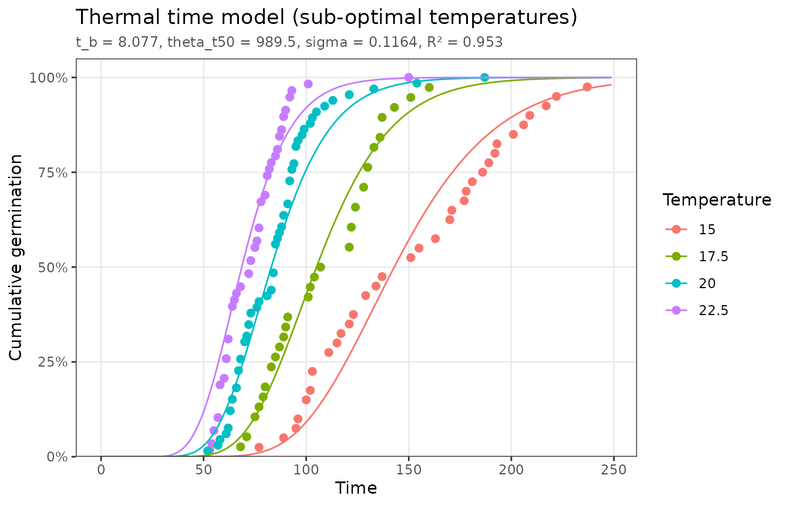
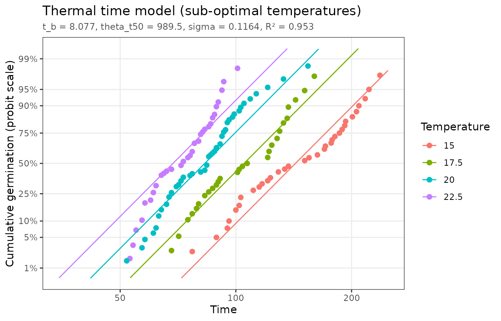
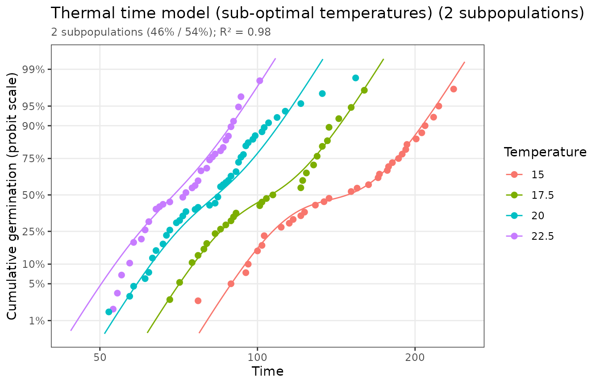

# Seed subpopulations

``` r

library(pbtm)
```

The threshold models assume that one normal distribution of thresholds
describes the whole seed lot. That is often not true. Commercial lots
are frequently blends of different productions, and conditions during
seed development can leave seeds with different dormancy or vigor. A lot
like this can be modeled as a mixture of distinct subpopulations, each
with its own threshold distribution. Their germination, weighted by each
subpopulation’s share of the lot, adds up to the observed time course
(Bello and Bradford, 2016; Bradford and Bello, 2022). For two
subpopulations:

``` math
g = w_1\, \Phi\left(\frac{X - \theta_{X1}/t_g - X_{b1}(50)}{\sigma_1}\right) +
(1 - w_1)\, \Phi\left(\frac{X - \theta_{X2}/t_g - X_{b2}(50)}{\sigma_2}\right)
```

where $`X`$ is the factor (temperature, water potential, …) and $`w_1`$
is the first subpopulation’s share. Every cumulative model in pbtm
(thermal time, hydrotime, hydrothermal time, aging, promoter, and
inhibitor) can be fit as a mixture with the `subpops` argument.

## A two-subpopulation seed lot

`thermal_time_subpop_data` comes from a lot that mixes two
subpopulations. A single thermal time distribution fits it reasonably
well on the usual scale:

``` r

single <- fit_thermal_time(thermal_time_subpop_data)
single
#> <pbtm_fit> Thermal time model
#> 
#>       t_b theta_t50     sigma 
#>     8.077     989.5    0.1164 
#> 
#> n = 133, pseudo-R2 = 0.9526, AIC = -715.8
autoplot(single)
```



The linearized scale shows the problem. A single log-normal distribution
would give a straight line at each temperature, but the data bend: the
fast and slow subpopulations follow different lines.

``` r

autoplot(single, x_scale = "log", y_scale = "probit")
#> Dropped 2 points that cannot be shown on the log/probit axes (e.g. 0% or 100%
#> germination).
```



Fitting two subpopulations captures the bend:

``` r

mix <- fit_thermal_time(thermal_time_subpop_data, subpops = 2)
mix
#> <pbtm_fit> Thermal time model with 2 subpopulations
#> 
#>  component weight   t_b theta_t50   sigma
#>          1 0.4636 5.261      1027 0.05914
#>          2 0.5364 9.322      1033 0.06085
#> 
#> n = 133, pseudo-R2 = 0.9796, AIC = -820.2
autoplot(mix, x_scale = "log", y_scale = "probit")
#> Dropped 2 points that cannot be shown on the log/probit axes (e.g. 0% or 100%
#> germination).
```



`mix$components` has one row per subpopulation with its share (`weight`)
and parameters. The flat coefficients follow the pattern `t_b1`, `t_b2`,
…, with the free mixing fractions named `w1`, `w2`, …

``` r

mix$components
#> # A tibble: 2 × 5
#>   component weight   t_b theta_t50  sigma
#>       <int>  <dbl> <dbl>     <dbl>  <dbl>
#> 1         1  0.464  5.26     1027. 0.0591
#> 2         2  0.536  9.32     1033. 0.0609
```

## Choosing the number of subpopulations

Adding subpopulations always improves the fit a little, so compare fits
with a criterion that penalizes the extra parameters. `subpops = "auto"`
fits one to `max_subpops` subpopulations and keeps the one with the
lowest AIC:

``` r

auto <- fit_thermal_time(thermal_time_subpop_data, subpops = "auto")
auto$subpop_table
#> # A tibble: 2 × 6
#>       k  npar pseudo_r2   rss   aic delta_aic
#>   <int> <dbl>     <dbl> <dbl> <dbl>     <dbl>
#> 1     1     3     0.953 0.576 -716.      104.
#> 2     2     7     0.980 0.247 -820.        0
```

Here two subpopulations are clearly better than one (a difference in AIC
of more than about 10 is strong evidence). A fit that fails to converge,
as three subpopulations often do on data like these, is left out of the
table.

## Interpret with care

Mixture fits are often *equifinal*: quite different sets of component
parameters can reproduce the same time course almost equally well. With
only germination time courses to go on, a mixture can reliably show that
a lot is *not* a single population and can improve predictions. The
individual components’ parameters, and even the exact number of
subpopulations, are much less certain. Some ways to firm them up:

- Collect time courses at more factor levels, which constrains the
  components much more than extra observations at the same levels.
- Hold parameters that should be shared by all components at known
  values. For example, estimate the base temperature from a
  single-population fit on a uniform lot.
- Check that the result is stable: a different `restarts` value or a
  different subset of the treatments should give similar components.
- Look for independent evidence of the subpopulations (seed size,
  source, dormancy tests).

Mixture fits start from several perturbed starting values (`restarts`,
12 by default) and keep the best; these runs use a fixed internal random
seed, so results are reproducible and do not affect your own random
number stream.

## References

Bello, P., Bradford, K.J. (2016) Single-seed oxygen consumption
measurements and population-based threshold models link respiration and
germination rates under diverse conditions. *Seed Sci. Res.* 26:
199–221. <https://doi.org/10.1017/S0960258516000179>

Bradford, K.J., Bello, P. (2022) Applying population-based threshold
models to quantify and improve seed quality attributes. In J Buitink, O
Leprince, eds, *Advances in Seed Science and Technology for More
Sustainable Crop Production*. Burleigh Dodds Science Publishing,
Cambridge, UK. <https://doi.org/10.19103/AS.2022.0105.05>
