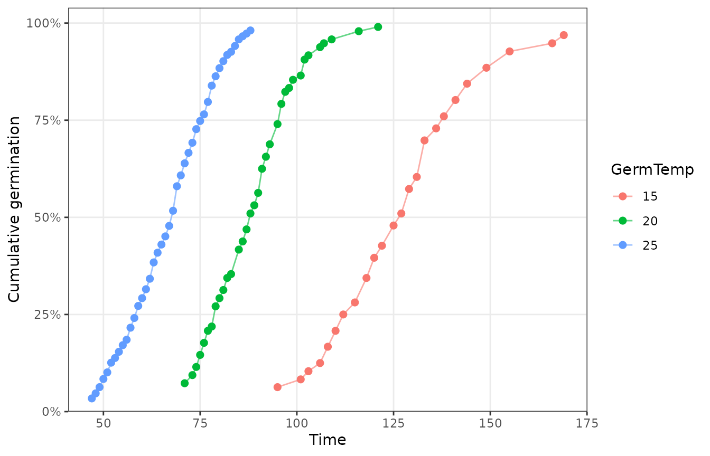
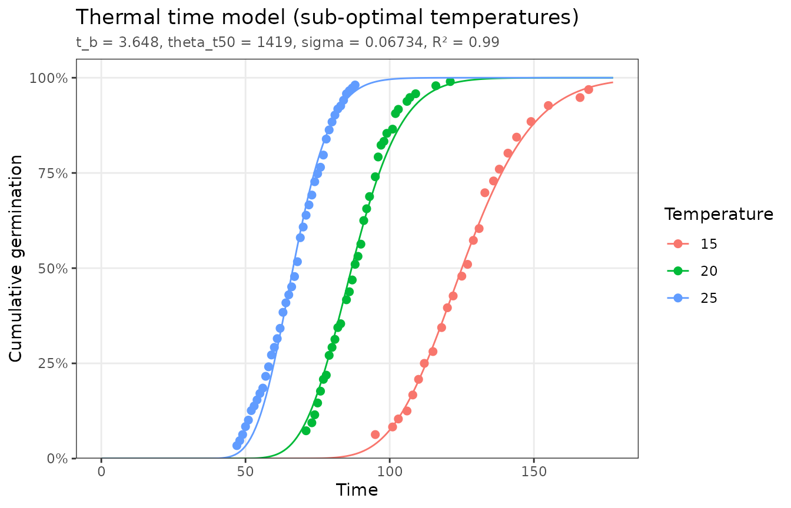
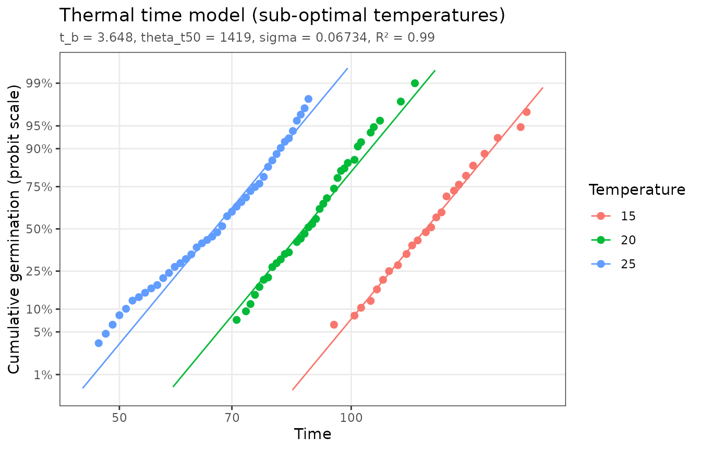
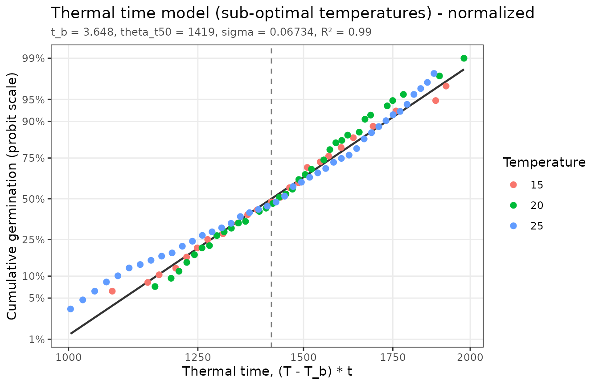

# Thermal time

``` r

library(pbtm)
```

## The model

Below the optimum temperature, seeds germinate faster the further the
temperature `T` exceeds a base temperature `T_b`, below which
germination does not occur. The *thermal time* to germination of
fraction `g` of the population is constant:

``` math
\theta_T(g) = (T - T_b)\, t_g
```

where $`t_g`$ is the time to germination of fraction `g`. Thermal times
vary among seeds, following a log-normal distribution with median
$`\theta_T(50)`$ and standard deviation $`\sigma`$ (on the log10 scale).
The fitted model is

``` math
g = \Phi\left(\frac{\log_{10}[(T - T_b)\, t_g] - \log_{10}\theta_T(50)}{\sigma}\right)
```

where $`\Phi`$ is the standard normal cumulative distribution. The model
is fit across all temperatures at once, so only temperatures at or below
the optimum should be included.

## Data

`thermal_time_data` has tomato seeds germinated in water at three
temperatures:

``` r

head(thermal_time_data)
#> # A tibble: 6 × 5
#>   TrtID TrtDesc          GermTemp CumTime CumFraction
#>   <dbl> <chr>               <dbl>   <dbl>       <dbl>
#> 1     1 Tomato-15C-Water       15      95       0.063
#> 2     1 Tomato-15C-Water       15     101       0.083
#> 3     1 Tomato-15C-Water       15     103       0.104
#> 4     1 Tomato-15C-Water       15     106       0.125
#> 5     1 Tomato-15C-Water       15     108       0.167
#> 6     1 Tomato-15C-Water       15     110       0.208
plot_germ_data(thermal_time_data, color = "GermTemp")
```



If your data include other treatments (for example several water
potentials), filter to a single level of those first, e.g. with
`subset(data, GermWP == 0)`. Otherwise their effects will be attributed
to temperature.

## Fitting

``` r

fit <- fit_thermal_time(thermal_time_data)
fit
#> <pbtm_fit> Thermal time model
#> 
#>       t_b theta_t50     sigma 
#>     3.648      1419   0.06734 
#> 
#> n = 100, pseudo-R2 = 0.9903, AIC = -686.8
summary(fit)
#> Thermal time model
#> 
#> Coefficients:
#>            estimate std_error fixed
#> t_b       3.648e+00  0.106326 FALSE
#> theta_t50 1.419e+03  9.826012 FALSE
#> sigma     6.734e-02  0.001165 FALSE
#> 
#> n = 100, parameters = 3, RSS = 0.09604, AIC = -686.8, pseudo-R2 = 0.9903
```

The estimated base temperature is 3.65 °C, and half of the seeds need
1419 degree-hours above it to germinate.

``` r

autoplot(fit)
```



## Linearized plots

Because thermal time is log-normally distributed, the fitted time course
at each temperature is a straight line on a log time axis with a probit
(normal quantile) fraction axis. These lines are parallel, since every
temperature shares the same $`\sigma`$. Points that curve away from
their line show where the model fits poorly.

``` r

autoplot(fit, x_scale = "log", y_scale = "probit")
```



The normalized plot converts every observation to thermal time,
$`(T - T_b)\,t`$, using the estimated base temperature. If the model
holds, all temperatures collapse onto one line, the population’s thermal
time distribution, and the dashed line marks $`\theta_T(50)`$:

``` r

autoplot(fit, type = "normalized")
```



## Using the model

The median time to germination at any sub-optimal temperature follows
from the parameters as $`t_{50} = \theta_T(50) / (T - T_b)`$:

``` r

p <- coef(fit)
temps <- c(15, 20, 25)
data.frame(GermTemp = temps, predicted_t50 = p[["theta_t50"]] / (temps - p[["t_b"]]))
#>   GermTemp predicted_t50
#> 1       15     125.02588
#> 2       20      86.79584
#> 3       25      66.47065
germ_speed(thermal_time_data, 0.5, groups = "GermTemp")
#> # A tibble: 3 × 4
#>   GermTemp Fraction  Time      GR
#>      <dbl>    <dbl> <dbl>   <dbl>
#> 1       15      0.5 126.  0.00791
#> 2       20      0.5  87.8 0.0114 
#> 3       25      0.5  67.6 0.0148
```

[`predict()`](https://rdrr.io/r/stats/predict.html) gives the full
predicted time course for new conditions:

``` r

new <- expand.grid(GermTemp = 12, CumTime = c(100, 150, 200, 250))
cbind(new, CumFraction = predict(fit, new))
#>   GermTemp CumTime  CumFraction
#> 1       12     100 0.0003132305
#> 2       12     150 0.2104641950
#> 3       12     200 0.8532827576
#> 4       12     250 0.9936092398
```

To explore alternative parameter values, hold some of them fixed:

``` r

fit_thermal_time(thermal_time_data, fixed = list(t_b = 5))
#> <pbtm_fit> Thermal time model
#> 
#>      t_b* theta_t50     sigma 
#>         5      1297   0.07013 
#> (* held fixed)
#> 
#> n = 100, pseudo-R2 = 0.9705, AIC = -581.7
```

## References

Bradford, K.J., Bello, P. (2022) Applying population-based threshold
models to quantify and improve seed quality attributes. In J Buitink, O
Leprince, eds, *Advances in Seed Science and Technology for More
Sustainable Crop Production*. Burleigh Dodds Science Publishing,
Cambridge, UK. <https://doi.org/10.19103/AS.2022.0105.05>
